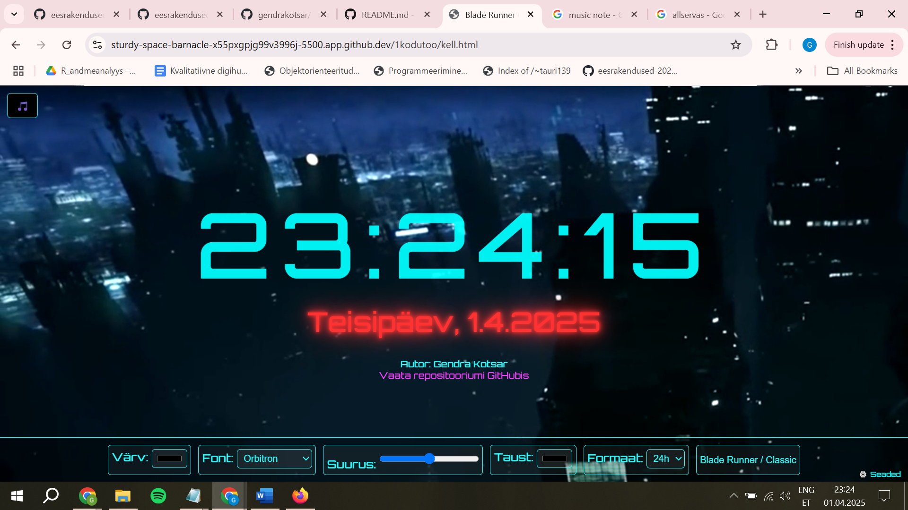

Autor: Gendra Kotsar

Ekraanipilt rakendusest:

Funktsionaalsus:

- Näitab reaalajas kella, nädalapäeva, kuupäeva ja aastat
- Kuus muudetavat atribuuti kasutaja poolt:
  1) Kella värv
  2) Taustavärv või video
  3) Font
  4) Suurus
  5) Ajaformaat (12h / 24h)
  6) Teema vahetamine (Blade Runner / Klassikaline)
- Taustaks on liikuv video (mp4), mis loob õige atmosfääri
- Taustamuusika, mida saab sisse/välja lülitada
- Atribuutide paneel ilmub hoveriga või nupu kaudu
- Kasutab JavaScript, HTML5, CSS3, eventListener-eid ja setInterval

